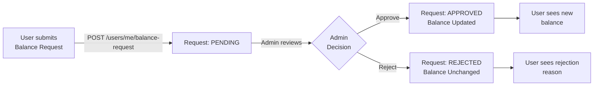

# Balance Request Endpoint

**Use this document when you want to understand the balance request API endpoints and how to submit or approve balance change requests.**

## Overview

The balance request endpoints handle user requests to modify their investment balance. Users submit requests specifying an amount and currency; admins review and approve them. The system maintains per-currency pending request limits to prevent duplicate submissions.

## Endpoints

### Submit Balance Request (POST)

**Endpoint:** `POST /users/me/balance-request`

**Authentication:** Required (Bearer token in Authorization header)

**Purpose:** User submits a request to increase their investment balance in a specific currency.

**Request Body:**
```json
{
  "amount": 500,
  "currency": "EUR",
  "note": "Quarterly investment contribution"
}
```

**Parameters:**

| Field | Type | Required | Constraints | Example |
|-------|------|----------|-------------|---------|
| `amount` | number | Yes | Positive, up to 999,999,999,999.99 | 500 |
| `currency` | string | Yes | One of: EUR, USD, SYP | "EUR" |
| `note` | string | No | Max 500 chars, optional audit comment | "Quarterly..." |

**Success Response (201 Created):**
```json
{
  "id": 42,
  "requester_id": 7,
  "type": "CHANGE_BALANCE",
  "status": "PENDING",
  "payload": {
    "amount": 500,
    "currency": "EUR"
  },
  "created_at": "2026-06-25T14:30:00",
  "decided_at": null,
  "admin_note": null
}
```

**Error Responses:**

| Status | Error | Reason | Recovery |
|--------|-------|--------|----------|
| 400 | Invalid currency | Currency not in (EUR, USD, SYP) | Select supported currency |
| 400 | Invalid amount | Negative or zero value | Submit positive amount |
| 400 | Pending request exists | User has pending request for this currency | Wait for admin decision or withdraw request |
| 401 | Unauthorized | Missing or invalid token | Login again |
| 404 | User not found | Token valid but user deleted (edge case) | Re-authenticate |

**Code Reference:** `backend/src/app/routers/users.py:143-178`

### Approve Balance Request (PATCH)

**Endpoint:** `PATCH /admin/requests/{request_id}/approve`

**Authentication:** Required (Bearer token + ADMIN role)

**Purpose:** Admin approves a pending balance request and applies the balance change.

**Request Body:**
```json
{}
```

(No body required; uses existing payload from request creation)

**Success Response (200 OK):**
```json
{
  "id": 42,
  "requester_id": 7,
  "requester_name": "John Doe",
  "type": "CHANGE_BALANCE",
  "status": "APPROVED",
  "payload": {
    "amount": 500,
    "currency": "EUR"
  },
  "created_at": "2026-06-25T14:30:00",
  "decided_at": "2026-06-25T15:45:23",
  "admin_note": null
}
```

**Backend Action:**
```python
# 1. Insert or update user_balances row
INSERT INTO user_balances (user_id, currency, amount)
VALUES (7, 'EUR', 500)
ON CONFLICT (user_id, currency)
DO UPDATE SET amount = amount + 500

# 2. Mark request as APPROVED
UPDATE admin_requests SET status = 'APPROVED', decided_at = NOW() WHERE id = 42
```

**Error Responses:**

| Status | Error | Reason |
|--------|-------|--------|
| 403 | Forbidden | User lacks ADMIN role |
| 404 | Request not found | Invalid request_id |
| 409 | Invalid transition | Request not in PENDING status |

**Code Reference:** `backend/src/app/routers/admin.py` (approve_request handler)

## Request Lifecycle



## Per-Currency Pending Request Logic

**Key Rule:** A user can have at most ONE pending request per currency.

**Examples:**

✓ **Allowed:**
- EUR request (PENDING) + USD request (PENDING) — different currencies
- EUR request (PENDING) + EUR balance approved — different request types

✗ **Forbidden:**
- EUR request (PENDING) + EUR request (PENDING) — duplicate currency

**Implementation** (`backend/src/app/routers/users.py:168-174`):
```python
# Check if user has pending request for this currency
existing = db.query(AdminRequest).filter(
    AdminRequest.requester_id == current_user.id,
    AdminRequest.type == "CHANGE_BALANCE",
    AdminRequest.status == "PENDING",
    AdminRequest.payload["currency"].astext == data.currency
).first()

if existing:
    raise HTTPException(
        status_code=400,
        detail=f"User has pending request for {data.currency}"
    )
```

## Response Transformation

### User's View of Own Balance

**Endpoint:** `GET /users/me`

**Response includes:**
```json
{
  "id": 7,
  "email": "user@example.com",
  ...
  "investment_balances": [
    {"currency": "EUR", "amount": 1500.00},
    {"currency": "USD", "amount": 3000.50}
  ]
}
```

**Mapping to Database:**
- Queries `user_balances` table
- Filters rows for current user_id
- Only non-zero balances returned (absence = 0)
- Serialized as list of {currency, amount} objects

### Admin's View of Request

**Endpoint:** `GET /admin/requests` (with filters)

**Response includes:**
```json
{
  "id": 42,
  "requester_id": 7,
  "requester_name": "John Doe",
  "type": "CHANGE_BALANCE",
  "status": "PENDING",
  "payload": {
    "amount": 500,
    "currency": "EUR"
  },
  "created_at": "2026-06-25T14:30:00",
  "decided_at": null,
  "admin_note": null
}
```

**Frontend Rendering** (Management Panel):
```
| Type    | User      | Betreff/Subject | Date       |
|---------|-----------|-----------------|------------|
| Balance | John Doe  | +500 EUR        | 25.06.2026 |
```

Extracted from payload: `+${amount} ${currency}`

## Validation and Error Handling

### Request Validation

1. **Authentication:** JWT must be valid and non-expired
2. **Amount:** Must be positive number
3. **Currency:** Must be in (EUR, USD, SYP)
4. **Pending check:** No existing pending request for same currency
5. **User exists:** Current user must exist in database

### Response Validation (Frontend)

The frontend prevents invalid submissions:
- Disable submit if amount ≤ 0
- Currency dropdown restricts to valid options
- Submit disabled if pending request exists for selected currency

## Testing

### Manual Test Cases

**Test 1: Normal flow (EUR request)**
```bash
# Request balance change
curl -X POST http://localhost:8000/users/me/balance-request \
  -H "Authorization: Bearer TOKEN" \
  -H "Content-Type: application/json" \
  -d '{"amount": 500, "currency": "EUR"}'

# Expected: 201 Created with request ID

# Admin approves
curl -X PATCH http://localhost:8000/admin/requests/42/approve \
  -H "Authorization: Bearer ADMIN_TOKEN"

# Expected: 200 OK, request status = APPROVED
```

**Test 2: Duplicate currency prevention**
```bash
# First request (should succeed)
curl -X POST http://localhost:8000/users/me/balance-request \
  -d '{"amount": 500, "currency": "EUR"}'

# Second request for same currency (should fail with 400)
curl -X POST http://localhost:8000/users/me/balance-request \
  -d '{"amount": 1000, "currency": "EUR"}'

# Expected: 400 Bad Request - "User has pending request for EUR"
```

**Test 3: Multi-currency simultaneous requests**
```bash
# EUR request
curl -X POST http://localhost:8000/users/me/balance-request \
  -d '{"amount": 500, "currency": "EUR"}'

# USD request (should succeed)
curl -X POST http://localhost:8000/users/me/balance-request \
  -d '{"amount": 1000, "currency": "USD"}'

# Expected: Both 201 Created, different request IDs
```

## Related Topics

- [Multi-Currency Investment Balance Feature](./multi-currency-investment-balance.md) - Comprehensive feature documentation
- [Admin Request Lifecycle](./admin-request-lifecycle.md) - Full request approval workflow
- [User Authentication](./user-authentication.md) - How authentication tokens work

---

*Last updated: 2026-06-25*
*Endpoint implementation: backend/src/app/routers/users.py*
